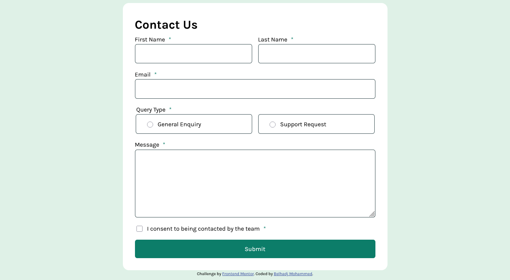

# Frontend Mentor - Contact form solution

This is a solution to the [Contact form challenge on Frontend Mentor](https://www.frontendmentor.io/challenges/contact-form--G-hYlqKJj). Frontend Mentor challenges help you improve your coding skills by building realistic projects. 

## Table of contents

- [Frontend Mentor - Contact form solution](#frontend-mentor---contact-form-solution)
  - [Table of contents](#table-of-contents)
  - [Overview](#overview)
    - [The challenge](#the-challenge)
    - [Screenshot](#screenshot)
    - [Links](#links)
  - [My process](#my-process)
    - [Built with](#built-with)
    - [What I learned](#what-i-learned)
    - [Useful resources](#useful-resources)
  - [Author](#author)
  - [Acknowledgments](#acknowledgments)

## Overview

### The challenge

Users should be able to:

- Complete the form and see a success toast message upon successful submission
- Receive form validation messages if:
  - A required field has been missed
  - The email address is not formatted correctly
- Complete the form only using their keyboard
- Have inputs, error messages, and the success message announced on their screen reader
- View the optimal layout for the interface depending on their device's screen size
- See hover and focus states for all interactive elements on the page

### Screenshot



### Links

- Solution URL: [Add solution URL here](https://your-solution-url.com)
- Live Site URL: [Add live site URL here](https://your-live-site-url.com)

## My process

### Built with

- Semantic HTML5
- CSS3 (Flexbox & Grid)
- JavaScript for validation and interactivity
- Accessible design principles (ARIA, focus states, labels)
- Responsive layout for mobile-first design

### What I learned

In this challenge, I improved my understanding of form validation using JavaScript.
Here’s a snippet from my validation logic:

```js
function validateField(field) {
  const errorElement =
    field.type === "radio"
      ? field.closest("fieldset").querySelector(".error-message")
      : field.parentElement.querySelector(".error-message");
  if (errorElement) {
    if (!field.validity.valid) {
      errorElement.textContent =
        field.dataset.error || "This field is required";
      return false;
    }
    errorElement.textContent = "";
  }
  return true;
}
```


### Useful resources

- [Kevin Powell - Youtube Channel ](https://www.youtube.com/@KevinPowell) - Helped me better understand modern CSS techniques and responsive design patterns and form validation.

## Author

- GitHub - [Mohammed Belhadj](https://www.github.com/m07ammed18)
- Frontend Mentor - [@m07ammed18](https://www.frontendmentor.io/profile/m07ammed18)

## Acknowledgments
Special thanks to Kevin Powell and the Frontend Mentor community for their tutorials and helpful discussions on accessible form design.